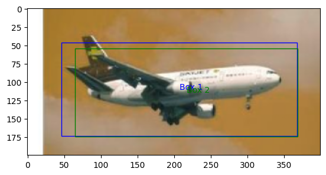
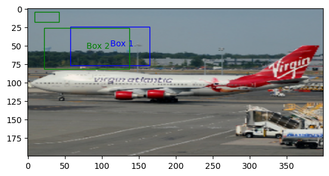

### Airplane Identification using YOLO v1 algorithm

This repository contains the result of the YOLO v1 implementation for Airplane detection.

All the files included in this repository can be found in the following [Google Drive](https://drive.google.com/drive/folders/1RyPLNyTtiGShjqlTQFEV-3RU-yMZ-HcM?usp=drive_link) repository.

- File structure:

```
├── README.md
├── TestYolo2BB.ipynb
├── TrainYolo2BB.ipynb
└── src
    ├── custom_load.py
    ├── data_loading.py
    ├── data_loading_test.py
    ├── fit_func.py
    ├── fit_func_dual.py
    ├── iou_compound_metric.py
    ├── iou_giou.py
    ├── script_coordinates.py
    ├── Utils.py
    ├── yolo_loss.py
    ├── yolo_model.py
    ├── yolo_model_2.py
    ├── yolo_model_3.py
    └── yolo_model_4.py
```

The yolo_model files contain the following structure:

`yolo_model.py`: Contains the model as implemented in the original paper.

`yolo_model_2.py`: Contains an update to the model that uses ResNet18 as a backbone.

`yolo_model_3.py`: Contains a ResNet34 implementation of the YOLO algorithm.

`yolo_model_4.py`: Contains the code for the ResNet50 implementation.

A yolo loss based on the Generalized Intersection Over Union (GIoU) were implenented on `yolo_loss`

The `IoU` and `GIou` code is localted in `iou_giou.py` in function format.

A custom metric was implemented based on the `MSE` of the box coordinates and the accuracy of the probability prediction.

`data_loading.py` contains the `Dataset` implementation for the data feeding process. The implementation used on this project set the coordinates in terms of the image and not in reference to the cell.

`custom_load.py` contains the `DataLoading` code for the batch implementation.

- Results:

The inference on new images was substandard. No metric was computed to get more information about the results.

Image used for training


Image used for testing


- References

[YOLO Tutorial](https://www.youtube.com/watch?v=n9_XyCGr-MI)