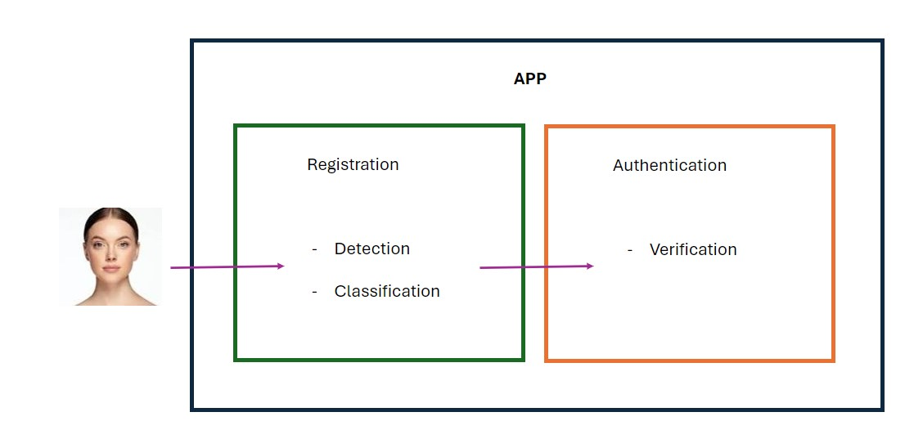
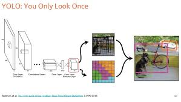
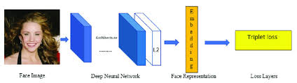

\title{Problem Description}
\maketitle

\begin{center}
Deep Learning
\end{center}

\begin{center}
Gregorio Alvarez
\end{center}

\clearpage

## Introduction

The goal of this project is to build upon a prior initiative from the Predictive Modeling course, which aimed to develop a model for an app designed to distinguish female and non-female users. The model's objective is to foster a secure environment where women can form a community and exchange experiences within the app.

## Problem Definition

The project encompasses three core components: **Image Detection, Classification, and Verification**, The first two encapsulated by a single model and the last one tailored for a second stage. Initially, the image detection algorithm is tasked with locating the subject's face within an image, while ensuring that it neither detects multiple faces nor processes unclear images. At the same time, the same model is designed to discern between male and female users. Finally, the verification algorithm is used for security aspect, permitting entry to the app only after confirming the individual's identity as a recognized member.
The images obtained from the regisration process are used during the verification process.

## Data

### Availability and Extraction Process
For the supervised learning tasks of image detection, classification, and verification, the prerequisite is a well-labeled dataset prior to the commencement of training. We have secured access to a dataset of approximately 9,000 images from multiple sources, with a significant subset of around 5,000 images that are paired. Kaggle stands out as the most notable source for our data bank.

1. With regard to the Detection problem, the images have been anottated with the help of a face detection pretrained model [facenet-pytorch](https://github.com/timesler/facenet-pytorch?tab=readme-ov-file). The anotation has been saved in a json format.

2. For the verification problem, which consists of around 5000 images from 32 individuals, the images had be cropped to be inputed to the model.

- The data is available at []

### Characteristics

1. The predicttors $X$ for the detection task are represented as a tensor of images with dimensions $(m, H, W, C)$ and the anticipated output tensor is expected to have the dimensions $(m, H, W, 5*S*B)$ where $m$ represents the batch size or the number of examples processed by the network simultaneously. The parameters $H$ and $W$ denote the height and width of the images, respectively and C is the number of channels, which will be defined as 3 for the standard RGB. $S$ represents the grid size and $B$ is the number of bounding boxes. For the first implementation the following parameters will be tested:

- m: Constrainted by the computational resources
- H: 448 pixels. Resize and padding will be added if necessary to maintain aspect ratio.
- W: 448 pixels
- 5: Contain the center, width and heigth coordinates, and the object existence probability.
- S: 14. defined by the precision and available computatiotional resources.
- B: 3. Also defined by the precision and computational resources.

2. The size of the predictors will be as follows $(m, 3, H, W, C)$. Where the $3$ represents the anchor, positive and negative images which will be feeded on each forward to calculate the triplet loss and obtained a trained embedding with dimensions $(E)$.

- E: The size of the embedding will be given by the computational resources which will be 128 or 256.

## Model Specifications

1. Object detection: For this task a YOLO v1 will be implemented based on the previously described input and output parameters and will follow the implementation from [Redmon J.](https://arxiv.org/pdf/1506.02640.pdf)

- Metrics: The model will be evaluated with the use of the Intersection Over Union (IOU) metric. 

2. Face Verification: this model will be implemented 

- Metrics: For this model, multiple metrics will be used which include the True Positive Rate (TPR) and False Positive Rate (FPR), and Area Under the ROC Curve (AUC-ROC). The first two will be responsible of checking the accuracy and precision of the model, while the third metric will take into consideration the robustness of the obtained model.

## Expectations

The objective is to enable testing of the three models via an API interface.

### References

- [Data repository](https://drive.google.com/drive/folders/17XdM1tib_I_5FDu-pu__5rVyC9PYnxPE?usp=sharing)

- [Deep Learning Specialization](https://www.deeplearning.ai/courses/deep-learning-specialization/)

- [Kaggle](https://www.kaggle.com/)

- [facenet-pytorch](https://github.com/timesler/facenet-pytorch?tab=readme-ov-file)

- [YOLO v1 original paper](https://arxiv.org/pdf/1506.02640.pdf)

