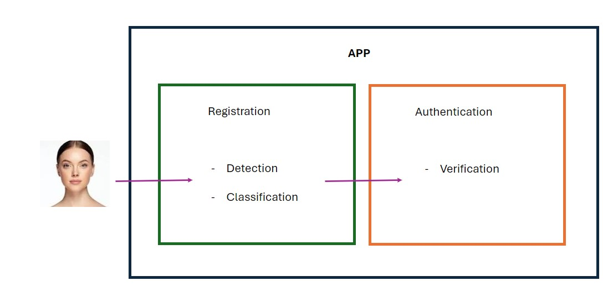

\title{Problem Description}
\maketitle

\begin{center}
Deep Learning
\end{center}

\begin{center}
Gregorio Alvarez
\end{center}

\clearpage

## Introduction

The goal of this project is to build upon a prior initiative from the Predictive Modeling course, which aimed to develop a model for an app designed to distinguish female and non-female users. The model's objective is to foster a secure environment where women can form a community and exchange experiences within the app.

## Problem Definition

The project encompasses three core components: **Image Detection, Classification, and Verification**, each tailored for distinct stages of the user identification process. Initially, the image detection algorithm is tasked with locating the subject's face within an image, while ensuring that it neither detects multiple faces nor processes unclear images. Subsequently, the classification algorithm comes into play, designed to discern between male and female users. Finally, the verification algorithm is used for security aspect, permitting entry to the app only after confirming the individual's identity as a recognized member.
The images obtained from the regisration process are used during the verification process.

## Data

### Availability and Extraction Process
For the supervised learning tasks of image detection, classification, and verification, the prerequisite is a well-labeled dataset prior to the commencement of training. We have secured access to a substantial dataset of approximately 18,000 images from multiple sources, with a significant subset of around 3,000 images that are paired. Kaggle stands out as the most notable source for our data bank.

1. With regard to the Detection problem, it is essential to annotate each image accurately. This annotation can be achieved by utilizing larger, pre-existing models or by employing dedicated annotation software.

2. For the Classification problem, we have utilized a larger model to pre-classify each image into male or female categories.

3. Addressing the Verification problem, we employ a larger model to detect pairs of faces within our dataset. These pairs are then used as input for the deep learning algorithm, which is integral to the verification process.

### Characteristics

1. The predictors $X$ for the detection task are represented as a tensor of images with dimensions $(m, H, W, 3)$, where $m$ represents the batch size or the number of examples processed by the network simultaneously. The parameters $H$ and $W$ denote the height and width of the images, respectively, and the number $3$ corresponds to the three color channels in an RGB image. Aiming for an initial model akin to YOLO, the anticipated output tensor is expected to have the dimensions $(m, G, B * 4 * 1)$, where $G$ signifies the number of grid cells.

2. For the classification problem, the independent variable remains an $(m, H, W, 3)$ tensor. The dependent variable, however, is an $(m)$ vector that represents the likelihood of each image belonging to the target class (female).

3. The input specification for the verification problem mirrors that of the prior issues, maintaining the $(m, H, W, 3)$ structure. The precise dimensions of the output tensor for this problem are yet to be determined and will be refined following further investigation.

## Expectations

The objective is to enable testing of the three models via an API interface.

### References
- [Deep Learning Specialization](https://www.deeplearning.ai/courses/deep-learning-specialization/)

- [Kaggle](https://www.kaggle.com/)

